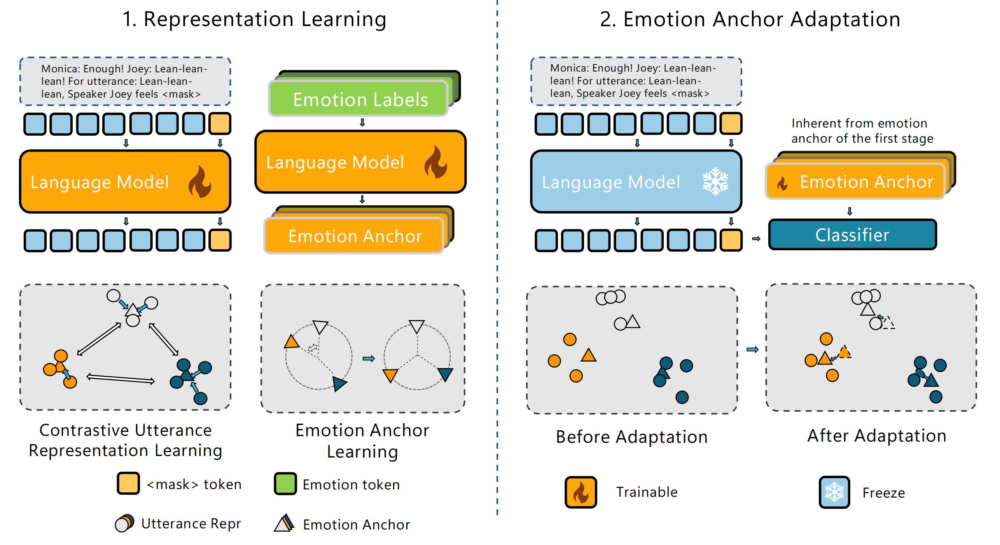

# Emotion-Anchored Contrastive Learning Framework for Emotion Recognition in Conversation

We study the emotion similarity problem in Emotion Recognition in Conversations. Specifically, we separate similar emotions in representation space. In this work, we utilize label encodings as anchors to guide the learning of utterance representations and design an auxiliary loss to ensure the effective separation of anchors for similar emotions. 

More details can be found in our paper:
Fangxu Yu, Junjie Guo, Zhen Wu, Xinyu Dai, "[Emotion-Anchored Contrastive Learning Framework for Emotion Recognition in Conversation](https://arxiv.org/abs/2403.20289)" 

## EACL



As illustrated in the above diagram, our EACL framework includes two steps: 
1. **Representation Learning**: composed of utterance representation learning and emotion anchor learning, which aims to guide LM to learn separable utterance representations.
2. **Emotion Anchor Adaptation**: is proposed to improve the classification ability of emotion anchors.

## Code
**1) Download this GitHub**
```
git clone https://github.com/Yu-Fangxu/EACL.git
```

**2) Setup Environment**


**3) Run Command for EACL**

bash run.sh IEMOCAP/MELD/EmoryNLP

<br> **If you find our repository helpful to your research, please consider citing:** <br>
```
@article{yu2024emotion,
  title={Emotion-Anchored Contrastive Learning Framework for Emotion Recognition in Conversation},
  author={Yu, Fangxu and Guo, Junjie and Wu, Zhen and Dai, Xinyu},
  journal={arXiv preprint arXiv:2403.20289},
  year={2024}
}
```
